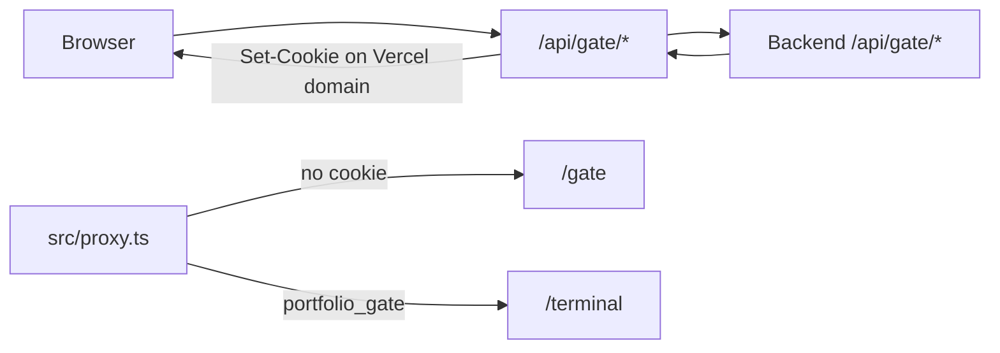

# portfolio-frontend — agent context (SSOT)

Next.js 16 App Router UI for [portfolio-backend](../portfolio-backend) (Rust/Axum on **8080**). Read this file first; avoid scanning the whole monorepo unless the task needs backend/infra detail.

**Backend agent context:** `portfolio-backend/AGENTS.md`  
**Cursor workflow:** `.cursor/rules/cursor-sdk-team-kit.mdc` (always apply — Team Kit + MCP before claiming done)

---

## Learned user preferences

- Solo developer — keep scope realistic for one person.
- Indonesian chat is fine; **gate/terminal puzzle copy stays English** (NATAS-style).
- Dual entry: standard landing at `/` + gated `/terminal` — do not remove terminal.
- **Commits/PRs only when explicitly asked.**
- Gate always on in dev; bypass via `GATE_BYPASS_SECRET` + header `X-Gate-Bypass` in **`src/proxy.ts`** only.
- User owns secrets in `.env.development` / Vercel; agents may scaffold `.env.example` only.
- Gate = NATAS web puzzles (login, `robots.txt` → `/s3cr3t/`, Referer), not Bandit/Behemoth/SSH.
- Landing/gate UI: **English default** with existing i18n toggle — not Indonesian-first on those surfaces.
- Blog, RSS, projects, contact, roadmap: **shared public routes** — do not duplicate across standard vs terminal UIs.
- `ROADMAP.md` removed May 2026; feature backlog lives here and in `FEATURE_PLANNING.md`.

---

## Multi-repo map

| Repo | Role | Default port |
|------|------|----------------|
| `portfolio-frontend` (this) | UI, edge proxy, gate BFF, PWA, admin | **3000** |
| `portfolio-backend` | REST + WS, gate validation, DB, proxies | **8080** |

| Doc | Purpose |
|-----|---------|
| `FEATURE_PLANNING.md` | Feature status SSOT (sprints, gaps) |
| `docs/dual-ui-gate.md` | Gate architecture + env rotation |
| `docs/features/FEATURE_33_PERFORMANCE.md` | CWV / PPR / Lighthouse sprint |
| `SECURITY.md` | Disclosure policy + frontend security notes |

---

## Tech stack

- **Next.js 16.1**, **React 19**, **TypeScript**, **Bun** (package manager + `bun run dev`)
- **Tailwind CSS 4**, **Radix UI**, **TipTap** (admin blog), **Sandpack** (playground)
- **Vitest** + Testing Library (unit); **Playwright** (`e2e/`)
- **PPR:** `cacheComponents: true` in `next.config.ts`
- **React Compiler** enabled in production builds
- **Logging:** pino → `POST /api/logs` (backend); **Web Vitals** RUM + Vercel Speed Insights
- **Deploy:** Vercel (production); backend on GCP Cloud Run

---

## Repository layout (where to edit)

```
src/
  app/                    # App Router pages + route handlers
    api/gate/             # Gate BFF (proxy to backend)
    api/roadmap/          # Optional roadmap BFF
    api/crypto/           # Client crypto handshake
    gate/1-3/             # Puzzle UI (client components)
    s3cr3t/               # L2 directory listing + users.txt proxy
    terminal/             # Gated terminal (noindex)
    admin/                # Dashboard (JWT client-side + protected routes)
    blog/, projects/, …   # Public content
  proxy.ts                # Next.js Proxy (CSP, gate redirect) — NOT middleware.ts
  components/
    atoms/ molecules/ organisms/   # Atomic design
    layout/               # SiteNav, footer, deferred widgets
  lib/
    gate/                 # gate-client, gate-proxy, referer-check, gate-server
    api/get-api-url.ts    # NEXT_PUBLIC_API_URL vs BACKEND_URL
    data/data-fetching.ts # SSR fetch helpers
    services/cached-blog-fetch.ts
    commands/             # Terminal command registry + parser
    logger/               # client-logger, web-vitals
    i18n/
  hooks/                  # use-terminal, etc.
public/
  manifest.json, sw.js    # PWA site-wide (scope /)
e2e/                      # Playwright specs
docs/                     # dual-ui-gate, features/, performance/
lighthouserc.js           # Desktop CWV CI
.cursor/rules/            # nextjs-completion-verification, cursor-sdk-team-kit
```

Path alias: `@/*` → `src/*`.

---

## Local development

```bash
cp .env.example .env.development
bun install
bun run dev                    # http://localhost:3000

# Backend must run on 8080 (see portfolio-backend/AGENTS.md)
# NEXT_PUBLIC_API_URL and BACKEND_URL should both point to http://localhost:8080

# Before claiming done on .ts/.tsx changes:
bun run lint
bun run type-check
```

Optional: `bun run test`, `bun run test:e2e`, `bun run build` (user must ask explicitly for build/e2e as completion gate).  
Known Vitest hang: `background-manager.test.tsx` (~16 min) — skip unless user requests full suite.

---

## Public routes & access

| Route | Access | Notes |
|-------|--------|-------|
| `/` | Public | Standard landing (RSC hero, deferred sections) |
| `/projects`, `/blog`, `/blog/[slug]`, `/blog/series/[slug]` | Public | Cached fetch where applicable |
| `/contact`, `/roadmap`, `/playground` | Public | Roadmap hits backend proxy at request time |
| `/rss.xml` | Public | Proxies/backend aggregate |
| `/gate`, `/gate/1`–`3` | Public puzzles | Redirect to `/terminal` if already unlocked |
| `/s3cr3t`, `/s3cr3t/users.txt` | Public (noindex) | L2 discovery; `users.txt` proxies backend challenge |
| `/terminal` | **Gated** | `portfolio_gate` cookie; `robots: noindex` |
| `/admin/*` | Auth | Admin JWT; auth provider scoped to admin layout |
| `/offline` | PWA | Offline fallback |

SEO: `src/app/robots.ts`, `src/app/sitemap.ts` — gate/terminal/admin/s3cr3t disallowed for crawlers.

---

## Gate (frontend responsibilities)

**Do not embed puzzle answers** in the client bundle. Validation is on the backend; UI only collects input and calls BFF.



| Piece | Path | Role |
|-------|------|------|
| Edge redirect | `src/proxy.ts` | `resolveGateRedirect`: `/terminal` → `/gate` without cookie; `/gate/*` → `/terminal` when unlocked |
| Bypass | `GATE_BYPASS_SECRET` | Header `X-Gate-Bypass` skips redirect (dev only) |
| Browser API | `src/lib/gate/gate-client.ts` | `fetch("/api/gate/...")` same-origin |
| BFF | `src/app/api/gate/{status,login,complete/3,unlock}/route.ts` | `proxyGateRequest` in `gate-proxy.ts` |
| Cookie re-home | `gate-proxy.ts` | Copies `gate_progress`, `portfolio_gate` from backend `Set-Cookie` |
| L2 listing | `src/app/s3cr3t/page.tsx` | NATAS-style index |
| L2 secret file | `src/app/s3cr3t/users.txt/route.ts` | Proxies `GET /api/gate/challenge/2/users.txt` |
| L3 Referer | `gate-level-3-client.tsx`, `referer-check.ts` | User must arrive from `/terminal` teaser |
| UI | `src/components/organisms/gate/*` | Login forms, progress, unlock |

**L2 player flow:** `/robots.txt` has `Disallow: /s3cr3t/` → browse `/s3cr3t/` → open `users.txt` → login level 2 on `/gate/2`.

**Production cookie fix:** Never call Cloud Run directly from the browser for gate — use `/api/gate/*` so cookies are same-site (Vercel), not blocked on `*.run.app`.

Emergency: `NEXT_PUBLIC_GATE_ENABLED=false` disables proxy redirects.

Full ops: `docs/dual-ui-gate.md`. Backend contract: `portfolio-backend/AGENTS.md` § Terminal gate.

---

## Next.js Proxy (`src/proxy.ts`)

Next.js 16 **Proxy** convention (replaces legacy middleware for this app):

- Exports `proxy(request)` + `config.matcher`
- **Gate redirects** run first (before CSP)
- **CSP** + security headers (`buildCsp`, `getSecurityHeaders`) — dev and prod
- Prod-only: CORS for `ALLOWED_ORIGINS`, device/geo headers, cache hints, slow-request logging
- Edge-safe logging only (no `node:fs` pino here)

Tests: `src/proxy/test/proxy.test.ts`, `e2e/security-headers.spec.ts`.

---

## API routes (BFF & server)

| Route | Backend target | Notes |
|-------|----------------|-------|
| `GET/POST /api/gate/*` | `/api/gate/*` | Forwards cookies; see `gate-proxy.ts` |
| `GET /api/roadmap/[endpoint]` | `/api/roadmap/*` | Server-side roadmap proxy |
| `POST /api/crypto/handshake` | — | Terminal crypto session setup |

**Client/server URL helpers:**

- Browser: `getApiUrl()` → `NEXT_PUBLIC_API_URL` (default `http://localhost:8080`)
- Server components / route handlers: `getServerApiUrl()` → `BACKEND_URL` first

Most data fetching uses `src/lib/data/data-fetching.ts` or feature-specific services (GitHub, blog, portfolio).

---

## Terminal experience

- Page: `src/app/terminal/page.tsx` + `src/components/layout/terminal-client.tsx`
- Commands: `src/lib/commands/command-registry.ts`, `command-parser.ts`; hook `use-terminal.ts`
- Heavy UI loaded dynamically (Sandpack only on `/playground`)
- **PWA install prompt** only after terminal onboarding tour completes (`public/sw.js`, `manifest.json`)
- i18n: `src/lib/i18n/i18n-service.ts` — reuse for gate/landing English + toggle

---

## Performance (Feature #33)

- `cacheComponents: true` — static shells + streaming; blog uses cached fetch (`cached-blog-fetch.ts`)
- Landing: RSC hero; below-fold sections skeleton + dynamic import
- Deferred: AI chat widget, non-critical client bundles (`deferred-ai-chat-widget.tsx`, `client-only-components.tsx`)
- Images: `optimized-image.tsx` + pinned `remotePatterns` in `next.config.ts` (no wildcard `**`)
- CI: `bun run perf:lighthouse`, bundle job in `.github/workflows/ci.yml`
- Docs: `docs/performance/BASELINE.md`, `grafana-cwv-dashboard.json`

Interactive routes (gate, terminal, admin, playground) stay client-heavy or request-time — do not force static generation on them.

---

## Admin & auth

- Layout: `src/app/admin/layout.tsx` + `admin-layout-inner.tsx` (isolates auth context from public pages)
- Login/register/2FA: `src/app/admin/login`, `register`, `2fa`
- Blog editor: TipTap `tiptap-editor.tsx`, image upload to backend `/api/upload/*`
- Protected UI: `protected-route.tsx` — tokens via backend JWT (HttpOnly refresh cookie pattern on API)

---

## Production (Vercel + Cloud Run)

| Variable | Where | Notes |
|----------|-------|-------|
| `NEXT_PUBLIC_BASE_URL` | Vercel | Canonical site URL (OG, sitemap) |
| `SITE_URL` | Vercel server | Must match backend for L3 Referer |
| `NEXT_PUBLIC_API_URL` | Vercel | **Browser** API origin — often same as public site if API is proxied; prod typically Cloud Run URL |
| `BACKEND_URL` | Vercel server only | SSR/BFF calls to Rust API (**no trailing slash**) |
| `GATE_BYPASS_SECRET` | Vercel server only | Never `NEXT_PUBLIC_*` |
| `NEXT_PUBLIC_GATE_ENABLED` | Vercel | `false` = emergency gate off |

**Common mistakes:**

- `NEXT_PUBLIC_API_URL` points to wrong `*.run.app` host → 404, gate appears broken
- Browser calling Cloud Run for gate → cookies blocked; use `/api/gate/*`
- `SITE_URL` / `NEXT_PUBLIC_BASE_URL` mismatch with backend → L3 Referer fails
- Roadmap credentials on Vercel only — they must live on **backend** (`ROADMAP_EMAIL` / `ROADMAP_PASSWORD` in GCP)

---

## Testing map

| Layer | Command | Location |
|-------|---------|----------|
| Unit | `bun run test` | `src/**/*.test.ts(x)`, colocated `test/` |
| E2E | `bun run test:e2e` | `e2e/gate.spec.ts`, `landing.spec.ts`, `security-headers.spec.ts`, … |
| Lint/types | **Required before done** | `bun run lint`, `bun run type-check` |

Gate E2E: `/terminal` redirects to `/gate` without `portfolio_gate` cookie.

---

## Verification checklist (this repo)

| Change type | Required |
|-------------|----------|
| `.ts`, `.tsx`, Next config | `bun run lint` + `bun run type-check` |
| Behavioral gate/proxy/CSP | Add/run relevant unit or e2e test; Team Kit `verify-this` when claiming behavior |
| Backend `.rs` only | Use `portfolio-backend` Rust suite instead |

Report pass/fail with terminal output — do not claim green without running commands.

---

## Quick env reference

See `.env.example`. Puzzle secrets (`GATE_L1_ANSWER`, `GATE_L2_ANSWER`, `GATE_TOKEN_SECRET`) live on **backend** only.

| Variable | Purpose |
|----------|---------|
| `NEXT_PUBLIC_BASE_URL` | Public site origin |
| `SITE_URL` | Server Referer / canonical checks |
| `BACKEND_URL` | SSR + route handlers → Rust |
| `NEXT_PUBLIC_API_URL` | Browser fetch to API |
| `ALLOWED_ORIGINS` | Proxy CORS allowlist |
| `NEXT_PUBLIC_GATE_ENABLED` | Gate on/off |
| `GATE_BYPASS_SECRET` | Dev bypass header |
| `NEXT_PUBLIC_GISCUS_*` | Blog comments (optional) |
| `GH_USERNAME` | Default GitHub stats user (token on backend) |
| `NEXT_PUBLIC_LOG_*` | Client log level + ingest URL |

Integrations (Gemini, Resend, CMS, roadmap login): configured on **backend** — see `portfolio-backend/.env.example`.

---

*Last expanded for agent onboarding — gate BFF, proxy.ts, NATAS L2 robots/s3cr3t, PPR/CWV Feature #33, dual UI. Update when routes or env contracts change.*
