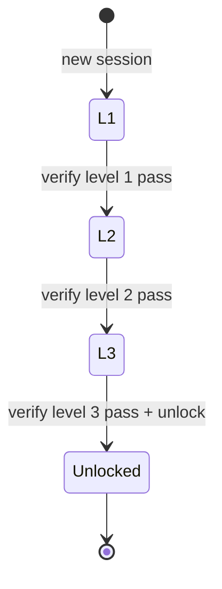
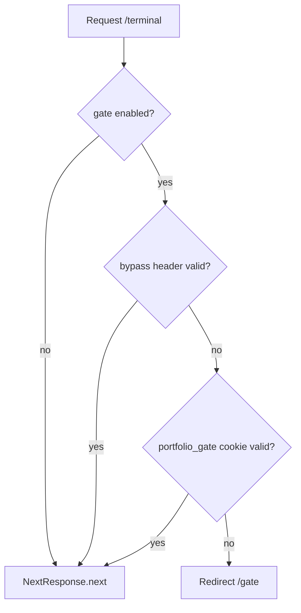

# Dual UI + Terminal Gate — Complete Implementation Checklist (Gap-Free)

Dokumen ini menggantikan versi sebelumnya. Setiap gap dari audit codebase sudah diisi: file exact path, kontrak API, keputusan arsitektur, test matrix, dan verify command.

**Legenda:** `[ ]` belum | `[~]` in progress | `[x]` done

---

## A. Gap audit — resolusi keputusan

| # | Gap yang ditemukan | Keputusan final | Action item |
|---|-------------------|-----------------|-------------|
| G1 | Plan menyebut `middleware.ts` | **Next.js 16 pakai `src/proxy.ts`** — gate guard ditambah di sini, BUKAN buat `middleware.ts` | 0B.2 |
| G2 | `next.config.ts` prod redirect `/terminal` → `/` | **Hapus redirect itu**; `/terminal` harus live di prod | 0B.2b |
| G3 | 19 file masih fallback `localhost:3001` | Buat **`getApiUrl()` shared helper** + refactor semua consumer | 0A.3–0A.4 |
| G4 | `sitemap.ts` juga pakai 3001 | Masuk refactor + **`getSiteUrl()` helper** | 0A.3, 0A.5 |
| G5 | Social links 3 sumber tidak konsisten | **`social-links.ts`** canonical; Twitter = `@yourblooo` (dari seo/config) | 0B.3 |
| G6 | Dua komponen `TerminalHeader` | **Admin pages tetap pakai admin `TerminalHeader`**; hanya `contact/page.tsx` pindah ke standard layout | 1D.4 |
| G7 | `page.test.tsx` mock `Terminal` tapi page pakai `TerminalClient` | Fix mock ke `TerminalClient` saat landing test | 1E.4 |
| G8 | `e2e/home.spec.ts` expect terminal di `/` | Split: **`e2e/landing.spec.ts`** (landing) + update home/terminal specs | 1E.6, 4.5 |
| G9 | i18n flat keys, bukan `nav.*` nested | Tambah keys flat ke `TranslationKeys`: `navHome`, `landingHeroTitle`, dll. | 1B.4 |
| G10 | Backend `.env.example` tidak ada | Create lengkap (semua vars dari code) | 0A.2 |
| G11 | `get_post` leak draft | Public 404 unless published/scheduled-past; admin JWT bypass | 0B.1 |
| G12 | `list_tags` + `rss.rs` filter lemah | Align ke visibility predicate yang sama | 0B.1d |
| G13 | OpenAPI server `localhost:3001` | Fix ke `8080` | 2A.5c |
| G14 | Gate zero implementation | Full spec di section F | Phase 2 |
| G15 | `@radix-ui/*` 27 packages, 0 import di `src/` | Hapus semua kecuali yang dipakai `bundler-optimization.ts` dynamic import | 3D |
| G16 | Admin API explorer orphan | Hapus 4 komponen + 4 test files (lihat 3C.6) | 3C.6 |
| G17 | `FEATURE_PLANNING.md` belum track sprint | Update Phase 4 | 4.1 |
| G18 | E2E CI tanpa backend/gate env | Mock gate via `NEXT_PUBLIC_GATE_ENABLED=false` untuk landing e2e; gate e2e butuh backend job atau MSW | 4.5 |
| G19 | `layout.tsx` metadata masih "Terminal Portfolio" | Root layout generic; page-level metadata per route | 1E.1 |
| G20 | JSON-LD di `page.tsx` terminal-themed | Pindah ke `/terminal` (noindex) + landing dapat Person/WebSite schema | 1A.1, 1C.7 |

---

## B. Architecture invariants (jangan dilanggar)

1. **Single source of truth:** Blog, RSS, share, Giscus hanya di shared routes — tidak diduplikasi di terminal.
2. **Gate scope:** Hanya `/terminal` gated. Public: `/`, `/blog`, `/projects`, `/contact`, `/roadmap`, `/admin/*`, `/rss.xml`.
3. **Validation:** Puzzle answers **hanya** di backend env — tidak pernah di frontend bundle.
4. **Dev default:** Gate ON; bypass hanya `GATE_BYPASS_SECRET` (header `X-Gate-Bypass` di proxy, server-only env).
5. **Emergency:** `NEXT_PUBLIC_GATE_ENABLED=false` → skip semua gate redirect.
6. **Cookies:** `portfolio_gate` (unlock) + `gate_progress` (session progress) — HttpOnly, SameSite=Strict, Secure di prod.
7. **Admin UI:** Tetap terminal-themed — jangan refactor admin layout ke standard landing.

---

## C. Shared utilities (buat dulu — Phase 0A.3)

### C.1 `src/lib/api/get-api-url.ts` (NEW)

```typescript
export function getApiUrl(): string {
  return (
    process.env.NEXT_PUBLIC_API_URL ??
    process.env.BACKEND_URL ??
    "http://localhost:8080"
  );
}
```

**Server-only variant** (untuk SSR routes yang perlu BACKEND_URL first):
```typescript
export function getServerApiUrl(): string {
  return process.env.BACKEND_URL ?? getApiUrl();
}
```

| # | Consumer file | Function to use |
|---|---------------|-----------------|
| C.1a | `lib/auth/auth-service.ts` | `getApiUrl()` |
| C.1b | `lib/auth/secure-auth.ts` | `getApiUrl()` |
| C.1c | `lib/data/data-fetching.ts` | `getServerApiUrl()` (SSR), `getApiUrl()` (client) |
| C.1d | `lib/services/contact-service.ts` | `getApiUrl()` |
| C.1e | `lib/services/admin-messages-service.ts` | `getApiUrl()` |
| C.1f | `lib/services/twofa-service.ts` | `getApiUrl()` |
| C.1g | `components/molecules/admin/blog-editor.tsx` | `getApiUrl()` |
| C.1h | `components/molecules/admin/image-upload-button.tsx` | `getApiUrl()` |
| C.1i | `components/organisms/admin/error-handler.tsx` | `getApiUrl()` |
| C.1j | `app/blog/page.tsx` | `getServerApiUrl()` |
| C.1k | `app/blog/[slug]/page.tsx` | `getServerApiUrl()` |
| C.1l | `app/rss.xml/route.ts` | `getServerApiUrl()` for API fetch |
| C.1m | `lib/gate/gate-client.ts` (Phase 2) | `getApiUrl()` |

**DoD:** `rg 'localhost:3001' src/` → 0 matches

**Test:** `src/lib/api/test/get-api-url.test.ts` — env precedence order

---

### C.2 `src/lib/api/get-site-url.ts` (NEW)

```typescript
export function getSiteUrl(): string {
  return (
    process.env.NEXT_PUBLIC_BASE_URL ??
    process.env.NEXT_PUBLIC_SITE_URL ?? // backward compat
    "http://localhost:3000"
  );
}
```

| # | Consumer | DoD |
|---|----------|-----|
| C.2a | `app/rss.xml/route.ts` | Channel + item links use `getSiteUrl()` |
| C.2b | `app/sitemap.ts` | Base URL from `getSiteUrl()` |
| C.2c | `lib/seo/config.ts` | Import `getSiteUrl()` or re-export |
| C.2d | `components/layout/site-footer.tsx` | RSS link `{getSiteUrl()}/rss.xml` |

**DoD:** RSS item links → port 3000; API fetch → port 8080

---

## Phase 0A — Environment

### 0A.1 Frontend `.env.example` rewrite
**File:** `portfolio-frontend/.env.example`

| # | Task | Exact change | DoD |
|---|------|--------------|-----|
| 0A.1a | Fix crypto defaults | Replace `CRYPTO_SESSION_TTL=1` → `# CRYPTO_SESSION_TTL=900000` (commented); same for PBKDF2 `100000` | `grep 'CRYPTO_.*=1'` → empty |
| 0A.1b | Gate section | Add `NEXT_PUBLIC_GATE_ENABLED=true` | Documented |
| 0A.1c | Gate bypass (server-only) | Add commented `# GATE_BYPASS_SECRET=` with note: used by `proxy.ts`, not exposed to browser | Comment only |
| 0A.1d | SEO verification | `GOOGLE_SITE_VERIFICATION=`, `YANDEX_VERIFICATION=`, `YAHOO_VERIFICATION=` | Placeholders |
| 0A.1e | Align existing | Confirm `BACKEND_URL` + `NEXT_PUBLIC_API_URL` = 8080 | Already correct |

---

### 0A.2 Backend `.env.example` (NEW — complete inventory)
**File:** `portfolio-backend/.env.example`

| Section | Variables | Default / empty |
|---------|-----------|-----------------|
| Server | `HOST`, `PORT`, `ENVIRONMENT` | `0.0.0.0`, `8080`, `development` |
| Database | `DATABASE_URL`, `DB_POOL_MIN`, `DB_POOL_MAX`, `DB_CONNECT_TIMEOUT`, `DB_CONNECT_RETRIES`, `DB_CONNECT_RETRY_SECS` | dev postgres URL, 2/10 |
| Auth | `JWT_SECRET`, `REFRESH_TOKEN_SECRET`, `JWT_ISSUER`, `JWT_AUDIENCE`, `TOTP_ISSUER` | **empty** |
| Admin bootstrap | `ADMIN_EMAIL`, `ADMIN_PASSWORD`, `ADMIN_HASH_PASSWORD` | **empty** |
| CORS | `ALLOWED_ORIGINS`, `FRONTEND_ORIGIN` | `http://localhost:3000` |
| Email | `RESEND_API_KEY`, `RESEND_FROM`, `CONTACT_EMAIL` | **empty** |
| Roadmap | `ROADMAP_AUTH_TOKEN` | **empty** |
| RSS/Site | `SITE_URL`, `SITE_TITLE`, `SITE_DESCRIPTION` | `http://localhost:3000`, pre-filled titles; note: = frontend `NEXT_PUBLIC_BASE_URL` |
| Upload | `UPLOAD_DIR` | `uploads` |
| Logging | `LOG_LEVEL`, `LOG_DIR`, `RUST_LOG` | `info`, `logs` |
| Swagger | `ENABLE_SWAGGER_UI` | `true` |
| Test | `TEST_DATABASE_URL` | comment only |
| Gate | `GATE_L1_ANSWER`, `GATE_L2_ANSWER`, `GATE_L3_ANSWER` | **empty** |
| Gate | `GATE_L2_STUB_MD5` | **empty** (optional precomputed) |
| Gate | `GATE_L3_OFFSET` | `528` |
| Gate | `GATE_L3_RET_ADDR` | `e0d7ffff` (hex placeholder for validation) |
| Gate | `GATE_L3_SHELLCODE_HASH` | **empty** (sha256 of expected shellcode blob) |
| Gate | `GATE_TOKEN_SECRET`, `GATE_BYPASS_SECRET` | **empty** |
| Gate | `GATE_COOKIE_MAX_AGE_DAYS` | `7` |
| Gate | `GATE_SESSION_TTL_HOURS` | `24` (progress cookie) |

---

### 0A.3 Docker Compose
**File:** `portfolio-backend/docker-compose.yml` — backend service `environment:`

Add after `ROADMAP_AUTH_TOKEN`:
```yaml
GATE_L1_ANSWER: ${GATE_L1_ANSWER:-}
GATE_L2_ANSWER: ${GATE_L2_ANSWER:-}
GATE_L3_ANSWER: ${GATE_L3_ANSWER:-}
GATE_L2_STUB_MD5: ${GATE_L2_STUB_MD5:-}
GATE_L3_OFFSET: ${GATE_L3_OFFSET:-528}
GATE_L3_RET_ADDR: ${GATE_L3_RET_ADDR:-e0d7ffff}
GATE_L3_SHELLCODE_HASH: ${GATE_L3_SHELLCODE_HASH:-}
GATE_TOKEN_SECRET: ${GATE_TOKEN_SECRET:-}
GATE_BYPASS_SECRET: ${GATE_BYPASS_SECRET:-}
GATE_COOKIE_MAX_AGE_DAYS: ${GATE_COOKIE_MAX_AGE_DAYS:-7}
GATE_SESSION_TTL_HOURS: ${GATE_SESSION_TTL_HOURS:-24}
SITE_URL: ${SITE_URL:-http://localhost:3000}
SITE_TITLE: ${SITE_TITLE:-Dimas Saputra}
SITE_DESCRIPTION: ${SITE_DESCRIPTION:-Full-Stack Developer Portfolio}
RESEND_API_KEY: ${RESEND_API_KEY:-}
RESEND_FROM: ${RESEND_FROM:-}
CONTACT_EMAIL: ${CONTACT_EMAIL:-}
```

**Verify:** `docker compose config` → no parse error

---

### 0A.4 Refactor all API URL consumers
→ See section **C.1** (complete file list)

### 0A.5 Refactor all site URL consumers
→ See section **C.2**

**Phase 0A verify block:**
```bash
cd portfolio-frontend && rg 'localhost:3001' src/ && echo FAIL || echo OK
cd portfolio-frontend && bun test src/lib/api/test/get-api-url.test.ts
```

---

## Phase 0B — Security & proxy gate skeleton

### 0B.1 Blog visibility fix (3 surfaces)
**Visibility SQL predicate** (reuse everywhere):
```sql
(
  (publish_at IS NOT NULL AND publish_at <= NOW())
  OR (publish_at IS NULL AND published = true)
)
```

| # | File | Function | Change |
|---|------|----------|--------|
| 0B.1a | `portfolio-backend/src/routes/blog.rs` | `get_post` | If no admin JWT: add visibility WHERE; else 404. If admin JWT valid: return any status. Do NOT increment view_count for non-public. |
| 0B.1b | `portfolio-backend/src/routes/blog.rs` | `list_tags` | Replace `published = true` with visibility predicate |
| 0B.1c | `portfolio-backend/src/routes/rss.rs` | `rss_feed` | Same visibility predicate |
| 0B.1d | `portfolio-backend/src/routes/blog.rs` | tests | Add `db_get_post_draft_returns_404_public` + `db_get_post_draft_returns_200_admin` |

**Optional refactor:** Extract `fn public_visibility_clause() -> &'static str` in blog.rs to avoid drift.

---

### 0B.2 Proxy gate guard (NOT middleware.ts)
**Files:** `src/proxy.ts`, `next.config.ts`, `src/proxy/test/proxy.test.ts`

| # | Task | Detail | DoD |
|---|------|--------|-----|
| 0B.2a | Extract helpers | Export `buildCsp`, `getSecurityHeaders`, `getCORSHeaders` if not already | Testable imports |
| 0B.2b | Add `shouldGateTerminal(pathname)` | Returns true for `/terminal`, `/terminal/*` | Unit test |
| 0B.2c | Add `isGateEnabled()` | Reads `NEXT_PUBLIC_GATE_ENABLED !== 'false'` | Default true |
| 0B.2d | Add bypass check | `request.headers.get('x-gate-bypass') === process.env.GATE_BYPASS_SECRET` (only if secret set) | Dev bypass |
| 0B.2e | Phase 0 stub redirect | `/terminal` without cookie → redirect `/gate` (cookie check stub: absent = redirect) | Manual test |
| 0B.2f | `/gate` unlocked redirect stub | Defer full impl to Phase 2B.5; stub cookie name `portfolio_gate` | — |
| 0B.2g | **Remove** `next.config.ts` lines 157–161 | Delete prod redirect `/terminal` → `/` | `/terminal` reachable in prod build |
| 0B.2h | Proxy tests | Add `describe('gate redirects')` with mocked env | Tests pass |

**Matcher:** Existing proxy matcher already excludes static assets — no change unless gate paths need inclusion (they're included by default).

**Frontend env for bypass:** Add to `.env.local` docs (not committed): `GATE_BYPASS_SECRET=dev-bypass`

---

### 0B.3 Social links canonical
**File:** `src/lib/data/social-links.ts` (NEW)

```typescript
export interface SocialLink {
  platform: string;
  url: string;
  handle?: string;
  icon: string; // lucide icon name or emoji for terminal
}

export const SOCIAL_LINKS: SocialLink[] = [
  { platform: "GitHub", url: "https://github.com/infinitedim", icon: "github" },
  { platform: "LinkedIn", url: "https://linkedin.com/in/infinitedim", icon: "linkedin" },
  { platform: "Twitter", url: "https://twitter.com/yourblooo", handle: "@yourblooo", icon: "twitter" },
  // Dev.to, Stack Overflow optional — include if still wanted in terminal social cmd
];
```

| # | Refactor | DoD |
|---|----------|-----|
| 0B.3a | `lib/commands/commands.ts` → `socialCommand` maps `SOCIAL_LINKS` | Terminal output unchanged format |
| 0B.3b | `lib/seo/config.ts` → `social` derived from `SOCIAL_LINKS` | OG/twitter tags consistent |
| 0B.3c | Test `src/lib/data/test/social-links.test.ts` | Count + URL assertions |

---

**Phase 0B verify block:**
```bash
cd portfolio-backend && cargo test get_post
cd portfolio-backend && cargo test blog
cd portfolio-frontend && bun test src/proxy/test/proxy.test.ts
cd portfolio-frontend && bun test src/lib/data/test/social-links.test.ts
```

---

## Phase 1A — Terminal route split

| # | Task | File(s) | DoD |
|---|------|---------|-----|
| 1A.1 | Create terminal route | `src/app/terminal/page.tsx` | Copy from current `page.tsx` |
| 1A.2 | Terminal metadata | same | `robots: { index: false, follow: false }`; title keeps terminal branding |
| 1A.3 | Move JSON-LD | same | WebPage schema stays on terminal only |
| 1A.4 | Terminal layout optional | `src/app/terminal/layout.tsx` | Optional: terminal-specific metadata wrapper |
| 1A.5 | Landing placeholder | `src/app/page.tsx` | Temporary minimal hero OK until 1C |
| 1A.6 | Grep internal links | `rg 'href="/"' src/` | Terminal CTAs point to `/gate` or `/terminal`, not assume `/` = terminal |

**Do NOT change:** `src/components/layout/terminal-client.tsx`, `terminal.tsx` — they move with route only.

---

## Phase 1B — Layout shell

### 1B.1 Components

| File | Type | Key props | a11y |
|------|------|-----------|------|
| `components/layout/site-nav.tsx` | Client (i18n) | `currentPath?: string` | `nav` landmark, skip link target `#main-content` |
| `components/layout/site-footer.tsx` | Server | — | Footer landmark |
| `components/layout/standard-page-layout.tsx` | Server | `children`, `title?` | Wraps nav + `<main id="main-content">` + footer |

**Nav links:**
| Label key | href |
|-----------|------|
| `navHome` | `/` |
| `navProjects` | `/projects` |
| `navBlog` | `/blog` |
| `navContact` | `/contact` |
| `navRoadmap` | `/roadmap` |
| `navTerminal` (CTA styled) | `/gate` |

### 1B.2 i18n keys (flat — add to `TranslationKeys` + en_US + id_ID)

**Nav:** `navHome`, `navProjects`, `navBlog`, `navContact`, `navRoadmap`, `navTerminal`

**Landing:** `landingHeroTitle`, `landingHeroTagline`, `landingCtaProjects`, `landingCtaContact`, `landingCtaTerminal`, `landingAboutTitle`, `landingSkillsTitle`, `landingBlogTitle`, `landingProjectsTitle`

**Gate chrome (bilingual UI only):** `gateLevelBandit`, `gateLevelNatas`, `gateLevelBehemoth`, `gateSubmit`, `gateHint`, `gateProgress`

**Gate narrative:** Stay hardcoded EN in gate components (OTW authentic) — NOT i18n.

---

## Phase 1C — Landing sections

| # | Component | Type | Data | Error state |
|---|-----------|------|------|-------------|
| 1C.1 | `hero-section.tsx` | Client | i18n | — |
| 1C.2 | `about-section.tsx` | Server | `fetchPortfolioSection('about')` | Empty: hide section |
| 1C.3 | `featured-projects.tsx` | Server | `getFeaturedProjects()` | Empty: "No projects" |
| 1C.4 | `skills-grid.tsx` | Server | portfolio API | Empty: hide |
| 1C.5 | `latest-posts.tsx` | Server | `GET /api/blog?pageSize=3&published=true` | Empty: link to /blog |
| 1C.6 | `terminal-cta.tsx` | Server | — | Link `/gate` |
| 1C.7 | Compose `page.tsx` | Server | Import all + Person JSON-LD | Lighthouse: no terminal bundle on `/` |

**Landing metadata (`page.tsx`):**
```typescript
title: "Dimas Saputra | Full-Stack Developer"
description: "Full-stack developer portfolio — projects, blog, and interactive terminal."
```

---

## Phase 1D — Shared pages (exact per file)

| # | Page | Before | After | Keep unchanged |
|---|------|--------|-------|----------------|
| 1D.1 | `projects/page.tsx` | Standalone | `StandardPageLayout` | Project grid logic |
| 1D.2 | `blog/page.tsx` | Standalone | `StandardPageLayout` | Pagination, filters |
| 1D.3 | `blog/[slug]/page.tsx` | Standalone | `StandardPageLayout` | **ShareButtons**, Giscus |
| 1D.4 | `contact/page.tsx` | `TerminalHeader` (admin) | `StandardPageLayout` | Contact form component |
| 1D.5 | `roadmap/page.tsx` | Minimal | `StandardPageLayout` | Roadmap fetch |

**Explicitly NOT changing:** `admin/*` pages — keep admin `TerminalHeader` + sidebar.

---

## Phase 1E — SEO & tests

| # | File | Change |
|---|------|--------|
| 1E.1 | `app/layout.tsx` | Generic title template `%s \| Dimas Saputra`; remove terminal-first default |
| 1E.2 | `app/sitemap.ts` | Use `getSiteUrl()`; **do not add** `/terminal`, `/gate` |
| 1E.3 | `app/robots.ts` | Add `disallow: ['/gate', '/terminal']` |
| 1E.4 | `app/test/page.test.tsx` | Test landing metadata; mock `TerminalClient` removed |
| 1E.5 | `app/terminal/page.test.tsx` | NEW — smoke render, noindex metadata |
| 1E.6 | `e2e/home.spec.ts` | Rename/repurpose → terminal at `/terminal` OR merge into new landing spec |
| 1E.7 | `e2e/landing.spec.ts` | NEW — `/` shows hero, nav links, no terminal testid |

---

## Phase 2A — Backend gate (full spec)

### 2A.1 Module structure
```
portfolio-backend/src/routes/gate.rs       # handlers
portfolio-backend/src/routes/gate/types.rs # optional submodule or inline
portfolio-backend/src/routes/gate/session.rs # session store
```

Register in `lib.rs`:
```rust
let gate_routes = Router::new()
    .route("/api/gate/status", get(gate::status))
    // ... all routes
    .layer(GovernorLayer { /* 10 req/min/IP */ })
    .with_state(gate_state);
app.merge(gate_routes);
```

### 2A.2 Session store (in-memory MVP)

```rust
struct GateSession {
    session_id: String,
    completed_levels: HashSet<u8>,
    failed_attempts: HashMap<u8, u32>,
    l2_manifest: Option<L2Manifest>,
    created_at: Instant,
}
```

- Cookie `gate_progress`: signed HMAC(session_id) using `GATE_TOKEN_SECRET`
- TTL: `GATE_SESSION_TTL_HOURS`
- Keyed in `Arc<RwLock<HashMap<String, GateSession>>>`

### 2A.3 API contracts

#### `GET /api/gate/status`
Response:
```json
{
  "unlocked": false,
  "currentLevel": 2,
  "completedLevels": [1],
  "hintsAvailable": { "2": 1 }
}
```
Reads `portfolio_gate` cookie + `gate_progress` session.

#### `POST /api/gate/verify`
Request: `{ "level": 1, "answer": "string", "meta": {} }`
Response success: `{ "passed": true, "nextLevel": 2 }`
Response fail: `{ "passed": false, "attempts": 4, "hint": null }`
- Constant-time compare via `subtle::ConstantTimeEq`
- Increment `failed_attempts`; return hint text at 3/6/10 thresholds

#### `POST /api/gate/unlock`
Precondition: levels 1–3 in session.completed_levels
Response: Set-Cookie `portfolio_gate=<signed_jwt>; HttpOnly; Path=/; SameSite=Strict`
JWT claims: `{ "sub": "gate", "exp": ..., "iat": ... }` signed with `GATE_TOKEN_SECRET`

#### Level 2 endpoints
| Endpoint | Request | Response |
|----------|---------|----------|
| `POST /api/gate/challenge/2/stub` | `{ "content": "..." }` | `{ "md5": "...", "suggestedFilename": "shell.php" }` |
| `POST /api/gate/challenge/2/manifest` | `{ "filename": "shell.php", "signature": "<md5>" }` | `{ "stored": true }` |
| `POST /api/gate/challenge/2/trigger` | `{ "filename": "phar://gate.phar/test.txt" }` | `{ "token": "...", "message": "..." }` if manifest valid + filename starts with `phar://` |

#### Level 3 endpoints
| Endpoint | Request | Response |
|----------|---------|----------|
| `POST /api/gate/challenge/3/crash` | `{ "input": "<pattern with BBBB at end>" }` | `{ "eipOffset": 528, "message": "Segmentation fault at 0x42424242" }` if len >= 532 |
| `POST /api/gate/challenge/3/run` | `{ "payload": "<base64 or hex>" }` | Validates: pad 528 + RET + 200 NOPs + shellcode hash; returns `{ "password": "<GATE_L3_ANSWER hint or token>" }` |

### 2A.4 Level lock enforcement
| Route | Guard |
|-------|-------|
| `/api/gate/challenge/2/*` | Session must have level 1 completed |
| `/api/gate/challenge/3/*` | Session must have level 2 completed |
| `/api/gate/unlock` | Levels 1–3 completed |

Return `403 { "error": "level_locked" }` if violated.

### 2A.5 Backend tests (exact cases)
| Test name | Assert |
|-----------|--------|
| `gate_verify_level1_correct` | passed=true |
| `gate_verify_level1_wrong_increments_attempts` | attempts=1 |
| `gate_verify_hint_at_3_fails` | hint non-null |
| `gate_level2_locked_without_level1` | 403 |
| `gate_l2_stub_returns_md5` | md5 matches content |
| `gate_l2_trigger_valid_phar` | token returned |
| `gate_l3_crash_finds_offset` | eipOffset=528 |
| `gate_l3_run_valid_payload` | success |
| `gate_unlock_sets_cookie` | Set-Cookie header present |
| `gate_rate_limit_returns_429` | after burst |

### 2A.6 OpenAPI
- Add tag `Gate`
- Fix server URL `http://localhost:8080`
- Document all 8 endpoints + DTOs

---

## Phase 2B — Frontend gate

### 2B.1 Types (`lib/gate/types.ts`)
```typescript
export interface GateStatus { unlocked: boolean; currentLevel: number; completedLevels: number[]; }
export interface VerifyRequest { level: number; answer: string; meta?: Record<string, unknown>; }
export interface VerifyResponse { passed: boolean; nextLevel?: number; attempts?: number; hint?: string; }
// ... challenge types
```

### 2B.2 `lib/gate/gate-client.ts`
Methods: `getStatus()`, `verify()`, `unlock()`, `l2Stub()`, `l2Manifest()`, `l2Trigger()`, `l3Crash()`, `l3Run()`
All use `fetch(getApiUrl() + '/api/gate/...', { credentials: 'include' })`

### 2B.3 Shared gate UI
| File | Responsibility |
|------|----------------|
| `components/molecules/gate/gate-progress.tsx` | 3-step bar with Bandit/Natas/Behemoth labels |
| `components/organisms/gate/gate-level.tsx` | Answer form, hint display, attempt counter |
| `app/gate/layout.tsx` | Monospace OTW aesthetic, shared CSS |
| `app/gate/page.tsx` | Redirect → `/gate/1` or show progress if mid-game |

### 2B.4 Level 1 — `UppercaseShell`
**File:** `components/organisms/gate/uppercase-shell.tsx`

State machine:
```
LOCKED → (user submits "$0") → ESCAPED → (user runs cat /etc/bandit_pass/bandit33) → PASSWORD_VISIBLE → (submit password to verify API) → COMPLETE
```

Fake commands: `ls`, `cat`, `whoami`, `man sh` — all uppercase errors
After escape: allow lowercase; `cat /etc/bandit_pass/bandit33` shows env-backed hint text (NOT real password — user must submit answer from env)

**Page:** `app/gate/1/page.tsx` — metadata `robots: noindex`

### 2B.5 Level 2 — `PharUploadSimulator`
3-step wizard UI with Executor pseudocode block (static HTML):
1. Textarea stub → call `l2Stub()`
2. Form filename + signature → `l2Manifest()`
3. Trigger input `phar://gate.phar/test.txt` → `l2Trigger()` → copy token to answer field

**Page:** `app/gate/2/page.tsx` — redirect to `/gate/1` if status.currentLevel < 2

### 2B.6 Level 3 — `OverflowPayloadBuilder`
1. "Fuzz" button sends pattern → displays offset 528
2. Hex textarea with length indicator
3. Stack diagram (static SVG or CSS): `[ buffer 528 | EIP 4 | NOP 200 | shellcode ]`
4. Shellcode blob displayed as read-only hex (from backend config constant in UI — the hash validates, not display of answer)

**Page:** `app/gate/3/page.tsx`

### 2B.7 Proxy integration (complete gate)
**File:** `src/proxy.ts`

| Condition | Action |
|-----------|--------|
| `/terminal` + gate enabled + no `portfolio_gate` cookie + no bypass | Redirect 302 → `/gate` |
| `/gate/*` + has valid `portfolio_gate` cookie | Redirect 302 → `/terminal` |
| `/gate/*` + gate disabled | Allow through |

Cookie validation Phase 2: call backend `GET /api/gate/status` with forwarded cookie (server-side in proxy) OR verify JWT locally if `GATE_TOKEN_SECRET` synced to frontend server env.

**Decision (from plan):** Proxy forwards cookie to backend `/api/gate/status` — single source of truth.

### 2B.8 Terminal welcome
**File:** `src/hooks/use-terminal.ts` or `terminal-client.tsx`

On mount, if sessionStorage `gate_just_unlocked` (set by gate level 3 success):
```typescript
appendHistory("bandit33 / natas34 / behemoth8 — choose your fighter. Type `help`.");
sessionStorage.removeItem('gate_just_unlocked');
```

### 2B.9 Frontend tests
| File | Cases |
|------|-------|
| `lib/gate/test/gate-client.test.ts` | Mock fetch verify/status |
| `components/organisms/gate/test/uppercase-shell.test.tsx` | $0 escape state |
| `app/gate/test/gate-pages.test.tsx` | Render smoke per level |
| `src/proxy/test/proxy.test.ts` | Gate redirect matrix |

---

## Phase 3 — Admin, commands, cleanup

### 3A Admin blog
| # | File | DoD |
|---|------|-----|
| 3A.1 | `app/admin/blog/page.tsx` | `'use client'` wrapper mounting `<BlogEditor />` inside admin layout |
| 3A.2 | `app/admin/page.tsx` | `<Link href="/admin/blog">Manage Posts</Link>` |

### 3B Blog terminal command
**File:** `lib/commands/blog-commands.ts`
```typescript
export const blogCommand = { name: 'blog', description: '...', execute: ... }
export const blogReadCommand = { name: 'blog read', ... }
```
Register in `use-terminal.ts` dynamic import block (same pattern as `socialCommand`).

### 3C Orphan deletion — exact file list

**Batch 3C.1** — delete + test:
- `src/components/organisms/terminal/terminal.legacy.tsx`

**Batch 3C.2:**
- `src/hooks/useI18n.ts`
- `src/hooks/test/useI18n.test.ts` (if exists)

**Batch 3C.3:**
- `src/components/organisms/terminal/terminal-features-integration.tsx`
- `src/components/organisms/terminal/test/terminal-features-integration.test.tsx`

**Batch 3C.4:**
- `src/components/molecules/terminal/virtualized-history.tsx`
- `src/components/molecules/terminal/virtualized-terminal-history.tsx`
- `src/components/molecules/terminal/test/virtualized-history.test.tsx`
- `src/components/molecules/terminal/test/virtualized-terminal-history.test.tsx`

**Batch 3C.5:**
- `src/components/molecules/terminal/real-time-performance-monitor.tsx`
- `src/components/molecules/terminal/test/real-time-performance-monitor.test.tsx`

**Batch 3C.6** — Admin API explorer:
- `src/components/molecules/admin/service-selector.tsx`
- `src/components/molecules/admin/method-selector.tsx`
- `src/components/molecules/admin/parameter-input.tsx`
- `src/components/molecules/admin/request-response-panel.tsx`
- `src/components/molecules/admin/test/service-selector.test.tsx`
- `src/components/molecules/admin/test/method-selector.test.tsx`
- `src/components/molecules/admin/test/parameter-input.test.tsx`
- `src/components/molecules/admin/test/request-response-panel.test.tsx`

**Batch 3C.7:**
- `src/components/molecules/admin/terminal-sidebar.tsx` (only if zero route imports — verify first)

**After each batch:** `bun test` → green before next batch.

### 3D Radix cleanup
```bash
# Audit command
for pkg in $(jq -r '.dependencies | keys[]' package.json | grep radix); do
  rg -l "$pkg" src/ || echo "UNUSED: $pkg"
done
```
Remove all UNUSED. Keep `@radix-ui/react-dialog` if `bundler-optimization.ts` needs it.

**Verify:** `bun run build && bun run type-check`

---

## Phase 4 — Docs, CI, final verification

### 4.1 Documentation files
| File | Content |
|------|---------|
| `FEATURE_PLANNING.md` | New sprint section: Dual UI + Gate, checklist link |
| `portfolio-frontend/README.md` | Dual entry diagram, env setup, gate bypass dev instructions |
| `portfolio-backend/README.md` | Gate env vars, API endpoints, puzzle rotation |
| `docs/dual-ui-gate.md` | Architecture, cookie flow, puzzle rotation quarterly |

### 4.2 CI updates

**Frontend `.github/workflows/ci.yml` e2e job** — add env:
```yaml
env:
  CI: "true"
  NEXT_PUBLIC_GATE_ENABLED: "false"  # landing e2e without backend
  NEXT_PUBLIC_BASE_URL: "http://localhost:3000"
  NEXT_PUBLIC_API_URL: "http://localhost:8080"
```

**Backend CI** (if separate workflow): gate tests in postgres job with:
```yaml
GATE_L1_ANSWER: test-l1
GATE_L2_ANSWER: test-l2
GATE_L3_ANSWER: test-l3
GATE_TOKEN_SECRET: test-secret-min-32-chars-long!!
GATE_BYPASS_SECRET: bypass-dev
```

**Gate e2e strategy:** `e2e/gate.spec.ts` runs only when `GATE_E2E_ENABLED=true` (optional CI job with backend service) OR uses `GATE_BYPASS_SECRET` header to test terminal access path only.

### 4.3 E2E specs

**`e2e/landing.spec.ts`:**
- `/` → title contains "Dimas Saputra"
- Nav links visible
- `[data-testid="terminal"]` NOT visible on `/`
- CTA "Enter Terminal" → `/gate`

**`e2e/gate.spec.ts`:**
- `/terminal` redirects to `/gate`
- With bypass header → `/terminal` loads
- (Full puzzle flow: requires backend + test answers env)

**Update `e2e/home.spec.ts`:** Move terminal assertions to `/terminal`.

### 4.4 Final verification checklist

```bash
# Phase 0
rg 'localhost:3001' portfolio-frontend/src/
cargo test -p portfolio-backend blog

# Phase 1
curl -s localhost:3000/ | grep -i 'Dimas Saputra'
curl -s localhost:3000/terminal | grep -i 'terminal'

# Phase 2
curl -c cookies.txt -b cookies.txt localhost:8080/api/gate/status
# ... full puzzle flow manual

# Full suite
cd portfolio-frontend && bun test && bun run build
cd portfolio-backend && cargo test
cd portfolio-frontend && bun run test:e2e
```

Manual QA matrix:
| Route | Expected |
|-------|----------|
| `/` | Standard landing, indexed |
| `/terminal` | Redirect `/gate` without cookie |
| `/gate/1` | Uppercase shell UI |
| `/gate` (unlocked) | Redirect `/terminal` |
| `/blog/[draft-slug]` | 404 public |
| `/admin/blog` | BlogEditor loads |
| ShareButtons on blog | Unchanged |

---

## D. Complete file inventory

### New files (~38)
```
portfolio-frontend/src/lib/api/get-api-url.ts
portfolio-frontend/src/lib/api/get-site-url.ts
portfolio-frontend/src/lib/api/test/get-api-url.test.ts
portfolio-frontend/src/lib/data/social-links.ts
portfolio-frontend/src/lib/data/test/social-links.test.ts
portfolio-frontend/src/lib/gate/gate-client.ts
portfolio-frontend/src/lib/gate/types.ts
portfolio-frontend/src/lib/gate/test/gate-client.test.ts
portfolio-frontend/src/app/terminal/page.tsx
portfolio-frontend/src/app/terminal/page.test.tsx
portfolio-frontend/src/app/gate/layout.tsx
portfolio-frontend/src/app/gate/page.tsx
portfolio-frontend/src/app/gate/1/page.tsx
portfolio-frontend/src/app/gate/2/page.tsx
portfolio-frontend/src/app/gate/3/page.tsx
portfolio-frontend/src/app/admin/blog/page.tsx
portfolio-frontend/src/components/layout/site-nav.tsx
portfolio-frontend/src/components/layout/site-footer.tsx
portfolio-frontend/src/components/layout/standard-page-layout.tsx
portfolio-frontend/src/components/organisms/landing/hero-section.tsx
portfolio-frontend/src/components/organisms/landing/about-section.tsx
portfolio-frontend/src/components/organisms/landing/featured-projects.tsx
portfolio-frontend/src/components/organisms/landing/skills-grid.tsx
portfolio-frontend/src/components/organisms/landing/latest-posts.tsx
portfolio-frontend/src/components/organisms/landing/terminal-cta.tsx
portfolio-frontend/src/components/molecules/gate/gate-progress.tsx
portfolio-frontend/src/components/organisms/gate/gate-level.tsx
portfolio-frontend/src/components/organisms/gate/uppercase-shell.tsx
portfolio-frontend/src/components/organisms/gate/phar-upload-simulator.tsx
portfolio-frontend/src/components/organisms/gate/overflow-payload-builder.tsx
portfolio-frontend/src/lib/commands/blog-commands.ts
portfolio-frontend/e2e/landing.spec.ts
portfolio-frontend/e2e/gate.spec.ts
portfolio-frontend/docs/dual-ui-gate.md
portfolio-backend/.env.example
portfolio-backend/src/routes/gate.rs
portfolio-backend/src/routes/gate/test (inline module tests)
```

### Modified files (~52)
All consumers in sections C.1, C.2, 0B, 1A–1E, 2A, 2B, 3A, 4.x plus `lib.rs`, `openapi.rs`, `docker-compose.yml`, `next.config.ts`, `proxy.ts`, both READMEs, FEATURE_PLANNING.md, ci.yml.

### Deleted files (~22)
Listed in section 3C.

---

## E. Commit order (11 commits — unchanged scope, clearer boundaries)

| # | Commit message scope | Verify before commit |
|---|---------------------|---------------------|
| 1 | `chore(env): add env examples and shared getApiUrl/getSiteUrl helpers` | rg 3001 = 0 |
| 2 | `fix(security): blog visibility + proxy gate skeleton + social-links` | cargo test + proxy tests |
| 3 | `feat(routes): move terminal to /terminal, remove prod redirect` | /terminal loads |
| 4 | `feat(layout): site nav, footer, standard page layout, i18n keys` | component render |
| 5 | `feat(landing): hero, about, projects, skills, blog sections` | / landing complete |
| 6 | `feat(pages): wrap shared routes + SEO metadata + sitemap` | shared pages nav |
| 7 | `feat(gate): backend gate module with OTW-inspired challenges` | cargo test gate |
| 8 | `feat(gate): frontend levels 1-3 + gate client` | manual L1 flow |
| 9 | `feat(gate): proxy cookie sync + terminal welcome + e2e` | /terminal gated |
| 10 | `feat(admin): blog route + terminal blog command + orphan cleanup` | bun test green |
| 11 | `docs(ci): dual-ui-gate docs, CI env, final polish` | full checklist |

---

## F. State machines (reference)

### Gate progression (server)


### Proxy decision (request to /terminal)


---

*Last updated: gap audit complete — ready for implementation Phase 0A.*
