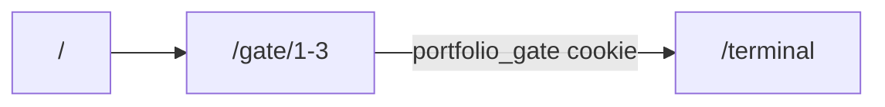

# Dual UI + Terminal Gate

Architecture and operations guide for the dual-entry portfolio.

## Routes

| Route | Access | Purpose |
|-------|--------|---------|
| `/` | Public | Standard landing (hero, projects, blog preview) |
| `/terminal` | Gated | Interactive terminal portfolio |
| `/gate`, `/gate/1-3` | Public (puzzles) | OverTheWire-style challenges |
| `/blog`, `/projects`, `/contact`, `/roadmap` | Public | Shared content (single source) |
| `/admin/*` | Auth | Admin dashboard |

## Gate flow

1. User visits `/terminal` → proxy redirects to `/gate` if no `portfolio_gate` cookie
2. User completes 3 puzzles (Bandit 32→33, Natas 33, Behemoth 7 — web-safe simulations)
3. Backend validates answers via `/api/gate/verify` and issues cookie via `/api/gate/unlock`
4. Proxy allows `/terminal`; welcome message shown once

## Environment

**Frontend** (`portfolio-frontend/.env.local`):

- `NEXT_PUBLIC_GATE_ENABLED=true` — set `false` to disable gate (emergency)
- `GATE_BYPASS_SECRET` — server-only; send header `X-Gate-Bypass: <secret>` in dev

**Backend** (`portfolio-backend/.env`):

- `GATE_L1_ANSWER`, `GATE_L2_ANSWER`, `GATE_L3_ANSWER` — puzzle answers (rotate quarterly)
- `GATE_TOKEN_SECRET` — signs `portfolio_gate` JWT (min 32 chars)
- `GATE_BYPASS_SECRET` — optional dev bypass (logged server-side)

See `.env.example` in both repos for full lists.

## Puzzle rotation

1. Generate new answers locally; update backend `.env`
2. Redeploy backend only — frontend has no embedded answers
3. Update `GATE_L3_SHELLCODE_HASH` if level 3 shellcode blob changes

## References

| Level | OTW inspiration |
|-------|-----------------|
| 1 | [Bandit 32→33](https://overthewire.org/wargames/bandit/bandit32.html) — `$0` uppercase shell escape |
| 2 | [Natas 33](https://overthewire.org/wargames/natas/natas33.html) — Phar / md5 chain |
| 3 | [Behemoth 7](https://overthewire.org/wargames/behemoth/behemoth7.html) — stack overflow offset 528 |

Implementation checklist: [dual-ui-gate-implementation-checklist.md](./dual-ui-gate-implementation-checklist.md)
