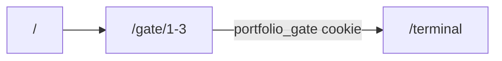

# Dual UI + Terminal Gate

Architecture and operations guide for the dual-entry portfolio.

## Routes

| Route                                        | Access           | Purpose                                         |
| -------------------------------------------- | ---------------- | ----------------------------------------------- |
| `/`                                          | Public           | Standard landing (hero, projects, blog preview) |
| `/terminal`                                  | Gated            | Interactive terminal portfolio                  |
| `/gate`, `/gate/1-3`                         | Public (puzzles) | OverTheWire-style challenges                    |
| `/blog`, `/projects`, `/contact`, `/roadmap` | Public           | Shared content (single source)                  |
| `/admin/*`                                   | Auth             | Admin dashboard                                 |

## Gate flow

1. User visits `/terminal` → locked teaser if no `portfolio_gate` cookie
2. User completes 3 NATAS-style puzzles:
   - **L1:** Login `yourbloo0` / `yourbloo0`
   - **L2:** Complete L1, then find `/s3cr3t/users.txt` → login `yourbloo1` + password from file
   - **L3:** Set `Referer: {siteUrl}/terminal` (navigate from `/terminal` teaser) → Enter Terminal
3. Backend validates L1/L2 via `/api/gate/login`, enforces Referer on `/api/gate/complete/3`, and issues signed cookie via `/api/gate/unlock`
4. Full terminal loads; welcome message shown once

## Environment

**Frontend** (local: `portfolio-frontend/.env.development`; production: `.env` on Vercel):

- `NEXT_PUBLIC_GATE_ENABLED=true` — set `false` to disable gate (emergency)
- `GATE_BYPASS_SECRET` — server-only; send header `X-Gate-Bypass: <secret>` in dev
- `NEXT_PUBLIC_BASE_URL` + optional server `SITE_URL` — must match backend `SITE_URL`/`FRONTEND_ORIGIN` for level 3 Referer validation

**Backend** (local: `portfolio-backend/.env.development`; production: `.env` on GCP or platform env vars):

- `GATE_L1_ANSWER=yourbloo0` — level 1 password
- `GATE_L2_ANSWER` — level 2 password (also served in `/s3cr3t/users.txt`)
- `GATE_TOKEN_SECRET` — signs `portfolio_gate` JWT (min 32 chars)
- `SITE_URL` or `FRONTEND_ORIGIN` — site origin for referer hints

See `.env.example` in both repos for full lists.

## Puzzle rotation

1. Generate new `GATE_L2_ANSWER` locally; update backend `.env`
2. Redeploy backend only — frontend has no embedded answers

## References

| Level | Inspiration                                                                                 |
| ----- | ------------------------------------------------------------------------------------------- |
| 1     | [Natas 0](https://overthewire.org/wargames/natas/natas0.html) — static credentials          |
| 2     | [Natas 3](https://overthewire.org/wargames/natas/natas3.html) — hidden `/s3cr3t/` directory |
| 3     | [Natas 5+](https://overthewire.org/wargames/natas/) — Referer header check                  |

Implementation checklist: [dual-ui-gate-implementation-checklist.md](./dual-ui-gate-implementation-checklist.md)
